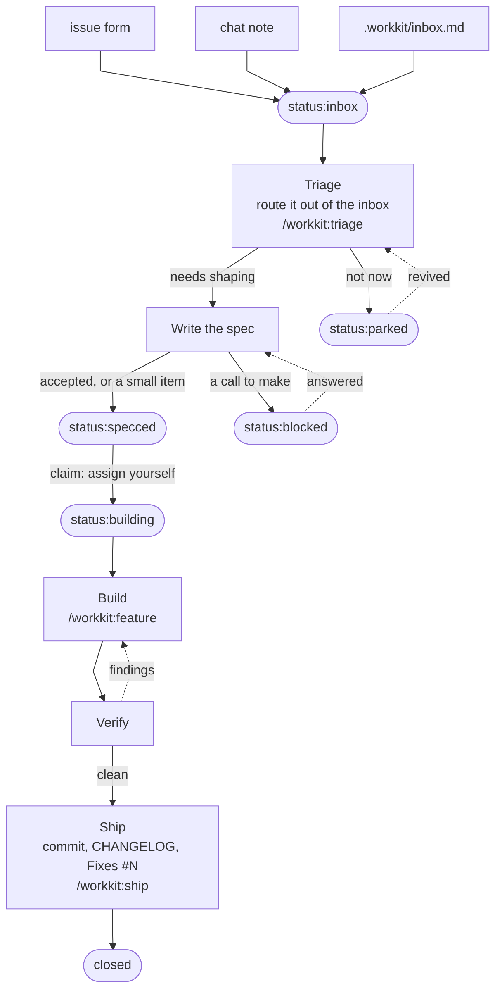

# workkit

The issue-pipeline workflow system as a Claude Code plugin. Install it and every session gains the same working standard: GitHub Issues as the single home for work items, labels as the pipeline, guard hooks that hold the line at commit time, a manager crew to delegate to, and the skills that drive the flow from "build this" to a shipped release.

## The road every item travels



Capture puts an item in `status:inbox`; triage is what routes it out. Three labels sit on the road: the flip to `status:specced` is the go-ahead to build, and `status:building` carries the work from the moment it starts until the ship close ends it. `blocked` and `parked` are side pockets: an answered question rejoins the road, a revived item goes back through triage. You still claim an issue by assigning it to yourself — the assignee is who holds it, the label is what makes it visible in flight. The letter of every hop — what each label means, who may flip it, how a claim expires: [`docs/project-state.md`](docs/project-state.md).

## The crew that works it


- The **manager** is whichever model your chat runs on, so the topology follows the model button: a frontier session never spawns the advisor, a workhorse session consults it for plans.
- **Crew sizing is policy, not mood**: a small change is the manager alone or one worker; a feature is one worker (a pair only under worktree isolation); the verifier runs once at claimed-done; the full review panel assembles only inside `workkit:review` and `workkit:ship`.
- Tiers come from `hooks/manager/ladder.json`; a repo's or a user's `.workkit/settings.json` `manager` block overrides them or turns the crew off. Effort is pinned in each agent's own frontmatter, never by the resolver.

## Install

From zero, one command:

```sh
git clone <this repo> && cd workkit
./workflow/workkit.sh setup
```

`setup` installs the plugin from this checkout, checks `gh`, loads the 9am daily-brief schedule (macOS launchd), offers to enable the repo you are standing in, and puts `workkit` on your PATH at `~/.local/bin` — printing the `export` line to add when that directory is not on it, never editing a shell rc. It is safe to re-run: every step checks before acting. `workkit doctor` reports what is set up and what has drifted; `workkit help` is the map.

The plugin alone is still two lines, if that is all you want:

```sh
claude plugin marketplace add <path-to-checkout>
claude plugin install workkit@workkit
```

The engine's stable address, `~/.claude/workkit` → this repo's `workflow/`, is installed by the standards heal itself the first time a session runs it. The skills and anything scripting the standard directly reach the engine there.

Plugins load at startup, so a new (or restarted) session is what puts a change into effect.

**It keeps itself current.** The session-start standards heal runs `workkit update --auto` once a day per repo, which re-renders the schedule when the checkout moved or the job template changed. It only ever updates a schedule you already installed, and it never creates a directory your machine does not have.

## What ships

### Hooks — the part that runs by itself

| Hook | When | What it does for you |
|---|---|---|
| `workflow/standards` | session opens | Brings an opted-in repo to the standard once a day: labels, issue templates, the required-checks CI workflow and its CHANGELOG lint, branch protection where it can, `.workkit/` seeded and ignored — then runs `workkit update --auto` to keep the machine's own installs current. Reports only what it fixed |
| `docs/state-check` | session opens | Tells you about open `status:inbox` issues, unfiled inbox notes, and document anomalies |
| `docs/session` | session opens, compaction included | Hands the session back its `.workkit/session.md` — the task queue it keeps across a compaction or a restart — and says when the file has grown past being a queue |
| `workflow/reload-guard` | session opens, then every message | Says once when the kit's agents, skills, or hook wiring changed after your session loaded — the case `/reload-plugins` exists for |
| `manager/resolver` | before a subagent spawns | Picks that spawn's model from the tier ladder and your live session model |
| `manager/profile` | every message | Reminds a capable session it is the MANAGER and should delegate |
| `safety/vendor-guard` | before any edit | Blocks edits to generated, vendored, and gitignored files |
| `safety/commit-gate` | before `git commit` | No commit unless tests pass, new source files come with tests, code carries a fresh review, and any CHANGELOG entry is in format. Heal bookkeeping (the version stamp and the current vendored linter, alone) skips the review and new-file checks |
| `safety/commit-language` | before `git commit` | Bounces kill/destroy/dead wording in commit messages, and off-format subject lines |
| `safety/issue-guard` | before a `gh issue`/`gh pr` write | Blocks outbound issue or PR text carrying a local `.env` value or a token-shaped string — every repo is assumed public. Names the key or the kind, never the match |
| `safety/inbox-guard` | before a read of the inbox | Keeps `.workkit/inbox.md` the owner's scratchpad: contents open only during a triage run; counting and appending stay free |
| `docs/board-guard` | after any edit | Holds `AGENTS.md` / `CLAUDE.md` to the document rules |
| `docs/changelog-guard` | after any edit | Holds a CHANGELOG entry to one short linked paragraph |
| `docs/change-tracker` | when a reply finishes | Nags about uncommitted work, a stale issue, and unfiled notes |

### Agents — the crew

`workkit:scout` (read-only recon) · `workkit:worker` (builds a brief) · `workkit:verifier` (blind review and the review scorer) · `workkit:advisor` (frontier consult for plans and hard calls) · `workkit:reviewer` (compliance lens that derives its checklist from your repo's live docs).

The first four are capability classes — the resolver hook gives each spawn its model from `hooks/manager/ladder.json`, so switching your own model mid-chat changes what the next spawn runs on.

### Skills — the part you (or Claude) trigger with words

`workkit:feature` · `workkit:grill` · `workkit:diagnose` · `workkit:review` · `workkit:simplify` · `workkit:triage` · `workkit:whats-next` · `workkit:migrate` · `workkit:ship`. Most load themselves when your message matches their triggers; you can also type them as `/workkit:<name>`.

### Tower — the dashboard

Mission control over everything the system already knows, in two processes: `npm run tower` starts the JSON API on port 8693, and `npx omega dev` inside `tower/app/apps/web` serves the dashboard on 4300.

Six pages. **Overview** is the control room. **Board** is the full issue board across every repo, columns by `status:` label with filters. **Crew** draws the running Claude sessions as an org chart, each subagent under its parent with its class, model and token spend. **Usage** is where the tokens went — by model, by agent class, over thirty days, and what it cost. **Health** is per-repo unpushed, uncommitted and unreleased work. **Brief** is the morning read — the same payload the 9am job under `jobs/` sends. An intake dialog sits on the topbar of all six.

A view over the system's own data, with two deliberate write paths: filing an issue from the intake dialog, and dragging a card between the Board's status columns, which really relabels it. Phone access goes through Tailscale. Reference: [`tower/README.md`](tower/README.md).

### The daily brief (jobs/)

The 9am morning notification, and the one job on the clock. It writes up the day that just ended first — `jobs/claude-nightly.sh` has Claude read yesterday's sessions and commits and files the summary in HQ — and then the brief: `jobs/brief-payload.js` assembles the same brief the tower serves, straight from the libraries, no server needed, and wraps it in the digest instruction; `jobs/claude-daily.sh` runs both, sends the brief through headless Claude on a capped budget, and fires a desktop notification with the headline. `bash jobs/install.sh` renders the launchd plist and loads the schedule (macOS, re-run safe). Detail: [`jobs/README.md`](jobs/README.md).

### Engine — `workflow/`

Plain shell and Node, no Claude Code knowledge: `workkit.sh` (the one command — `setup` · `update` · `doctor` · `enable` · `decline` · `note`), `labels.json` (the label SSOT), `standards.sh` (the idempotent heal, plus `--enable` / `--decline` / `--state`), `changelog.js` (the entry-format linter the hooks call), `changelog-links.js` (release-time commit links and contributor handles), `wk.sh` (the capture CLI — `wk.sh note "the thought"` drops a bullet into the nearest participating repo's inbox, or your own `~/.workkit/inbox.md` outside one), and the templates a repo receives when it opts in.

## Opting a repo in

Participation is deliberate. `workkit enable <repo>` writes that repo's `.workkit/settings.json` yes; `workkit decline <repo>` records your personal no in `~/.workkit/settings.json` (the engine underneath is `workflow/standards.sh --enable` / `--decline`). A repo that has answered neither hears one offer per session and is never written to.

## Layout

```
.claude-plugin/   plugin.json + marketplace.json (this repo is its own marketplace)
hooks/            hooks.json + the hook groups, resolved via ${CLAUDE_PLUGIN_ROOT}
agents/           the crew (namespaced workkit:<name>)
skills/           the nine workflow skills (namespaced workkit:<name>)
workflow/         the agent-agnostic engine
tower/            mission control — api/ (the JSON API) + app/ (the OMEGA dashboard)
jobs/             the 9am job — summaries then brief, payload builders, runners, launchd schedule
docs/             project-state.md (the spec) · agents.md (the crew contract)
tests/            npm test
```

## Docs

- [`docs/project-state.md`](docs/project-state.md) — the spec: labels, capture and triage, issue anatomy, queue semantics, `.workkit/`, plans, `_attic/`, HQ, the migration recipe
- [`AGENTS.md`](AGENTS.md) — architecture overview for agent sessions
- [`docs/agents.md`](docs/agents.md) · [`workflow/README.md`](workflow/README.md) — the crew contract and the engine reference
- [`jobs/README.md`](jobs/README.md) — the daily job: the summaries step, the brief, payloads, runners, schedule, install
