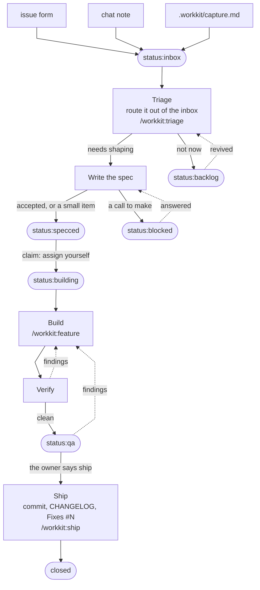
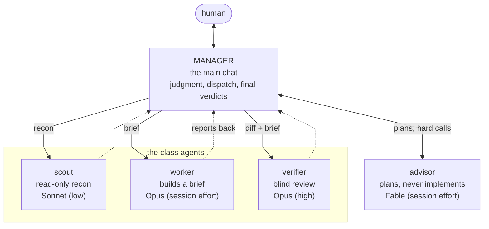

# workkit

The issue-pipeline workflow system as a Claude Code plugin. Install it and every session gains the same working standard: GitHub Issues as the single home for work items, labels as the pipeline, guard hooks that hold the line at commit time, a manager crew to delegate to, and the skills that drive the flow from "build this" to a shipped release.

## The road every item travels



Capture puts an item in `status:inbox`; triage is what routes it out. Four labels sit on the road: the flip to `status:specced` is the go-ahead to build, `status:building` carries the work from the moment it starts, and `status:qa` is where it parks once it is built and verified — in your working tree, waiting on your check, until your word "ship" runs the ship and the close ends it. `blocked` and `backlog` are side pockets: an answered question rejoins the road, a revived item goes back through triage. You still claim an issue by assigning it to yourself — the assignee is who holds it, the label is what makes it visible in flight. The letter of every hop — what each label means, who may flip it, how a claim expires: [`docs/project-state.md`](docs/project-state.md).

## The crew that works it



- The **manager** is whichever model your chat runs on, so the topology follows the model button: a frontier session never spawns the advisor, a workhorse session consults it for plans.
- **Crew sizing is policy, not mood**: a small change is the manager alone or one worker; a feature is one worker (a pair only under worktree isolation); the verifier runs once at claimed-done; the full review panel assembles only inside `workkit:review` and `workkit:ship`.
- Tiers come from `hooks/manager/ladder.json`; a repo's or a user's `.workkit/settings.json` `manager` block overrides them or turns the crew off. Effort is pinned in each agent's own frontmatter, never by the resolver.

## Install

From zero, one command:

```sh
git clone <this repo> && cd workkit
./workflow/workkit.sh setup
```

`setup` installs the plugin from this checkout, checks `gh`, loads the 9am daily-brief schedule (macOS launchd), creates your private HOME REPO and clones the tower project into `~/.workkit/tower`, seeds the cloud brief's workflow and the code it runs into that clone, wires the brief's two secrets onto that same home repo — never onto this one, which is the plugin everybody installs (the Claude token is minted only if you say yes at the prompt; the other is set from what your machine already knows), offers to enable the repo you are standing in, and puts `workkit` on your PATH at `~/.local/bin` — printing the `export` line to add when that directory is not on it, never editing a shell rc. It is safe to re-run: every step checks before acting. `workkit doctor` reports what is set up and what has drifted; `workkit help` is the map.

The plugin alone is still two lines, if that is all you want:

```sh
claude plugin marketplace add <path-to-checkout>
claude plugin install workkit@workkit
```

The engine's stable address, `~/.claude/workkit` → this repo's `workflow/`, is installed by the standards heal itself the first time a session runs it in a participating repo — and from a real checkout only, so a fixture copy never takes the machine's address. A machine whose repos have not joined yet gets the same address from `workkit setup` or `workkit update`. The skills and anything scripting the standard directly reach the engine there.

Plugins load at startup, so a new (or restarted) session is what puts a change into effect.

**It keeps itself current.** The session-start standards heal runs `workkit update --auto` once a day per repo, which re-renders the schedule when the checkout moved or the job template changed. It only ever updates a schedule you already installed, and it never creates a directory your machine does not have.

## What ships

### Hooks — the part that runs by itself

| Hook | When | What it does for you |
|---|---|---|
| `workflow/standards` | session opens | Brings an opted-in repo to the standard once a day: labels, issue templates, the required-checks CI workflow and its CHANGELOG lint, branch protection where it can, `.workkit/` seeded and ignored — then runs `workkit update --auto` to keep the machine's own installs current. Reports only what it fixed — and until `workkit setup` has run on this machine, every session is told to ask you to run it |
| `docs/state-check` | session opens | Tells you about open `status:inbox` issues, unfiled captures, and document anomalies |
| `docs/session` | session opens, compaction included | Hands the session back its `.workkit/agents/session.md` — the task queue it keeps across a compaction or a restart — and says when the file has grown past being a queue |
| `workflow/reload-guard` | session opens, then every message | Says once when the kit's agents, skills, or hook wiring changed after your session loaded — the case `/reload-plugins` exists for |
| `manager/resolver` | before a subagent spawns | Picks that spawn's model from the tier ladder and your live session model |
| `manager/profile` | every message | Reminds a capable session it is the MANAGER and should delegate |
| `safety/vendor-guard` | before any edit | Blocks edits to generated, vendored, and gitignored files |
| `safety/commit-gate` | before `git commit` | No commit unless tests pass, new source files come with tests, code carries a fresh review, and any CHANGELOG entry is in format. The suite runs for the commits that carry code — a docs-only commit and a version-only bump in `package.json` or `.claude-plugin/plugin.json` skip it. A suite still running at the gate's own deadline is ended and the commit bounces, so a run the harness would cancel never slips through. Staging and committing in one command bounces too — the gate reads the index before your command runs, so it cannot see what an in-command `git add` will sweep in: stage first, then commit. And a check that stands down says so in one visible line, never in silence. Heal bookkeeping (the version stamp and the current vendored linter, alone) skips the review and new-file checks |
| `safety/commit-language` | before `git commit` | Bounces kill/destroy/dead wording in commit messages, and off-format subject lines |
| `safety/issue-guard` | before a `gh issue`/`gh pr` write, a GraphQL discussion/issue mutation, or a `gh api` REST write to an issue or pull endpoint | Blocks outbound text carrying a local `.env` value or a token-shaped string — every repo is assumed public. Names the key or the kind, never the match |
| `safety/capture-guard` | before a read or a write of the capture file | Keeps `.workkit/capture.md` the owner's capture surface: reading it and clearing it open only during a triage run, adding to it never — counting stays free |
| `docs/board-guard` | after any edit | Holds `AGENTS.md` / `CLAUDE.md` to the document rules |
| `docs/changelog-guard` | after any edit | Holds a CHANGELOG entry to one short linked paragraph |
| `docs/session-guard` | after any edit | Holds `.workkit/agents/session.md` to a lean task queue — bounces a write leaving it over 40 content lines or a bullet over 350 characters |
| `docs/change-tracker` | when a reply finishes | Nags about uncommitted work, a stale issue, and unfiled notes — once per change, then silent until something moves |

### Agents — the crew

`workkit:scout` (read-only recon) · `workkit:worker` (builds a brief) · `workkit:verifier` (blind review and the review scorer) · `workkit:advisor` (frontier consult for plans and hard calls) · `workkit:reviewer` (compliance lens that derives its checklist from your repo's live docs).

The first four are capability classes — the resolver hook gives each spawn its model from `hooks/manager/ladder.json`, so switching your own model mid-chat changes what the next spawn runs on.

### Skills — the part you (or Claude) trigger with words

`workkit:feature` · `workkit:interview` · `workkit:diagnose` · `workkit:review` · `workkit:simplify` · `workkit:triage` · `workkit:whats-next` · `workkit:state` · `workkit:migrate` · `workkit:parallel` · `workkit:ship`. Most load themselves when your message matches their triggers; you can also type them as `/workkit:<name>`.

### Tower — the dashboard

Mission control over everything the system already knows, in two processes behind one command: `npm run tower` starts the JSON API on port 8693 and the dashboard on 4300 together.

Six pages. **Overview** is the control room. **Board** is the full issue board across every repo, columns by `status:` label with filters. **Crew** draws the running Claude sessions as an org chart, each subagent under its parent with its class, model and token spend. **Usage** is where the tokens went — by model, by agent class, over thirty days, and what it cost. **Health** is per-repo unpushed, uncommitted and unreleased work. **Brief** is the morning read — the same payload the 9am job under `jobs/` sends. An intake dialog sits on the topbar of all six.

A view over the system's own data, with two deliberate write paths: filing an issue from the intake dialog, and dragging a card between the Board's status columns, which really relabels it. Phone access goes through Tailscale. Reference: [`tower/README.md`](tower/README.md).

### The daily brief (jobs/)

The morning on the clock, and **one script for it — `jobs/morning.sh`, run by both schedulers**, your machine's 9am agent and the GitHub Actions workflow on your home repo. Each of its four steps asks whether the place it woke up in can do that step, and says so by name when it cannot. The summaries go first, on your machine, where the transcripts and the git history are — `jobs/claude-nightly.sh` writes the day that just ended up and publishes it as a Discussion on your home repo, with a weekly rollup on a Sunday and a monthly on the 1st, each reading its inputs back from the API. Then the seeded runner is reconciled: the copies of these scripts your home repo runs are refreshed by content from this checkout and pushed only when they changed, so the cloud step next in line never runs a stale generation. Then the brief, which runs **in the cloud**: it needs the board-sweeping token, and that lives on your home repo, so here the step is the trigger and nothing else — `workkit setup` seeded the workflow, the code it runs and the two secrets there, and the runner composes the brief, sends it through headless Claude on a capped budget, and publishes it as a `brief: <date>` Discussion, so a closed lid no longer means a quiet morning (a 17:30 UTC cron backs the trigger up). A trigger that cannot be made is a briefless morning with the reason in the log, never a half-brief composed from what your machine could reach; `npm run brief` composes and sends one here whenever you want to see it. Last it rebuilds the tower project and pushes the site to the home repo's `gh-pages` branch, after the brief has gone, so a build can never delay nine o'clock. `bash jobs/install.sh` renders the launchd plist and loads the schedule (macOS, re-run safe). Detail: [`jobs/README.md`](jobs/README.md).

### Engine — `workflow/`

Plain shell and Node, no Claude Code knowledge: `workkit.sh` (the one command — `setup` · `update` · `doctor` · `publish` · `tower` · `enable` · `decline` · `heal` · `note`), `labels.json` (the label SSOT), `standards.sh` (the idempotent heal, plus `--enable` / `--decline` / `--state`), `home.sh` + `discussions.sh` + `publish.sh` (the home repo's lifecycle, its Discussions API, and the gh-pages publish), `changelog.js` (the entry-format linter the hooks call), `changelog-links.js` (release-time commit links and contributor handles), `wk.sh` (the capture CLI — `wk.sh note "the thought"` drops a bullet into the nearest participating repo's `capture.md`, or files an issue on the home repo outside one), and the templates a repo receives when it opts in.

## The home repo

`workkit setup` creates one private repo, `<login>/workkit`, and clones it into `~/.workkit/tower` — the one git repo in the global layer, seeded from this kit's own `tower/app` so it is a real site project you can open, edit and build. `~/.workkit` itself stays a plain folder holding what only this machine knows, split by who writes it: `settings.json` is yours to edit (the site options — which repo the site publishes from, whether it publishes at all, and any custom domain; setup asks that publish question once, at the end of the run that built the path for it, and never asks again — a fresh yes is also asked for the domain, and any run that leaves the switch on publishes the site before it exits), `.repos.json` is the engine's roster and your declines, `.cache.json` is throwaway state, and `jobs/` is the job state; the clone is engine territory and carries nothing hand-written, not even a `.workkit/` of its own. The repo is where the work that belongs to no single project lives: its ISSUES are the cross-project queue, the nursery for projects that do not exist yet, and where a capture made outside every project lands directly — drained by every triage run from any repo, which also proposes graduating a cluster of captures into a real repo, created only on your word — its DISCUSSIONS are where the daily summaries are published, and its `gh-pages` branch is the dashboard built locally and served by GitHub Pages — the board readable from a phone, which bakes no data at all and speaks GitHub live with a token you paste into that browser once, reading the issues and moving and filing them just as the dashboard on your machine does. Nothing generated is committed as source. `workkit doctor` reports where the clone stands; the engine never force-pushes main.

## Opting a repo in

Participation is deliberate. `workkit enable <repo>` writes that repo's `.workkit/settings.json` yes; `workkit decline <repo>` records your personal no in `~/.workkit/.repos.json` (the engine underneath is `workflow/standards.sh --enable` / `--decline`). A repo that has answered neither hears one offer per session and is never written to.

## Layout

```
.claude-plugin/   plugin.json + marketplace.json (this repo is its own marketplace)
hooks/            hooks.json + the hook groups, resolved via ${CLAUDE_PLUGIN_ROOT}
agents/           the crew (namespaced workkit:<name>)
skills/           the eleven workflow skills (namespaced workkit:<name>)
workflow/         the agent-agnostic engine
tower/            mission control — api/ (the JSON API) + app/ (the OMEGA dashboard)
jobs/             the 9am job — summaries, brief, publish: payload builders, runners, launchd schedule
docs/             project-state.md (the spec) · agents.md (the crew contract) · history-purge.md (the rewrite runbook)
tests/            npm test
```

## Docs

- [`docs/project-state.md`](docs/project-state.md) — the spec: labels, capture and triage, issue anatomy, queue semantics, `.workkit/`, plans, `_attic/`, the global layer, the migration recipe
- [`AGENTS.md`](AGENTS.md) — architecture overview for agent sessions
- [`docs/agents.md`](docs/agents.md) · [`workflow/README.md`](workflow/README.md) — the crew contract and the engine reference
- [`jobs/README.md`](jobs/README.md) — the daily job: the summaries step, the brief, payloads, runners, schedule, install
