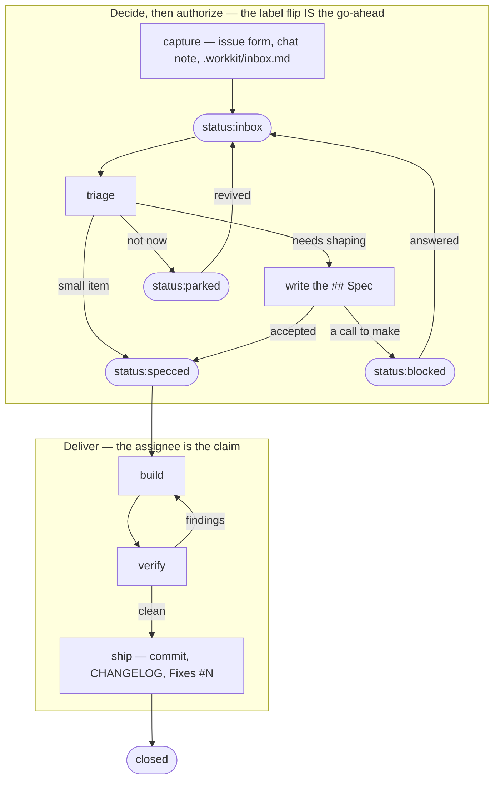
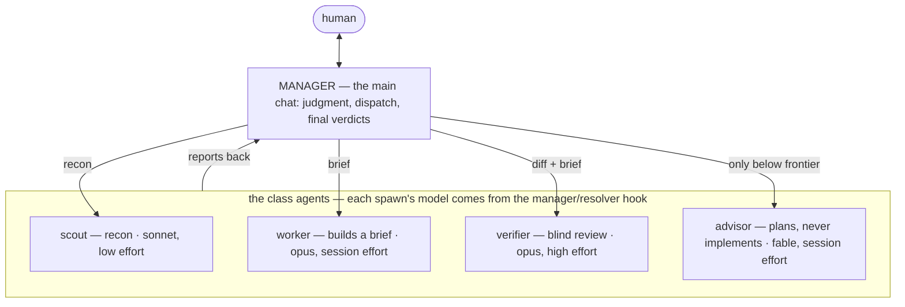

# workkit

The issue-pipeline workflow system as a Claude Code plugin. Install it and every session gains the same working standard: GitHub Issues as the single home for work items, labels as the pipeline, guard hooks that hold the line at commit time, a manager crew to delegate to, and the skills that drive the flow from "build this" to a shipped release.

## The road every item travels



Only two labels sit on the road: `status:inbox` (captured, nothing authorized) and `status:specced` (the spec is written and accepted, so building is authorized). `blocked` and `parked` are side pockets. Build, verify, and ship have no label of their own — the issue stays `status:specced` while the work runs, and the assignee is what marks it in flight; claiming an issue means assigning it to yourself. The rules behind every hop: [`docs/project-state.md`](docs/project-state.md).

## The crew that works it



- The **manager** is whichever model your chat runs on, so the topology follows the model button: a frontier session never spawns the advisor, a workhorse session consults it for plans.
- **Crew sizing is policy, not mood**: a small change is the manager alone or one worker; a feature is one worker (a pair only under worktree isolation); the verifier runs once at claimed-done; the full review panel assembles only inside `workkit:review` and `workkit:ship`.
- Tiers come from `hooks/manager/ladder.json`; a repo's or a user's `.workkit/settings.json` `manager` block overrides them or turns the crew off. Effort is pinned in each agent's own frontmatter, never by the resolver.

## Install

```sh
claude plugin marketplace add <path-to-checkout>
claude plugin install workkit@workkit
```

The engine's stable address, `~/.claude/workkit` → this repo's `workflow/`, is installed by the standards heal itself the first time a session runs it. The skills and anything scripting the standard directly reach the engine there.

Plugins load at startup, so a new (or restarted) session is what puts a change into effect.

## What ships

### Hooks — the part that runs by itself

| Hook | When | What it does for you |
|---|---|---|
| `workflow/standards` | session opens | Brings an opted-in repo to the standard once a day: labels, issue templates, the required-checks CI workflow, branch protection where it can, `.workkit/` seeded and ignored. Reports only what it fixed |
| `docs/state-check` | session opens | Tells you about open `status:inbox` issues, unfiled inbox notes, and document anomalies |
| `manager/resolver` | before a subagent spawns | Picks that spawn's model from the tier ladder and your live session model |
| `manager/profile` | every message | Reminds a capable session it is the MANAGER and should delegate |
| `safety/vendor-guard` | before any edit | Blocks edits to generated, vendored, and gitignored files |
| `safety/commit-gate` | before `git commit` | No commit unless tests pass, new source files come with tests, code carries a fresh review, and any CHANGELOG entry is in format |
| `safety/commit-language` | before `git commit` | Bounces kill/destroy/dead wording in commit messages |
| `docs/board-guard` | after any edit | Holds `AGENTS.md` / `CLAUDE.md` to the document rules |
| `docs/changelog-guard` | after any edit | Holds a CHANGELOG entry to one short linked paragraph |
| `docs/change-tracker` | when a reply finishes | Nags about uncommitted work, a stale issue, and unfiled notes |

### Agents — the crew

`workkit:scout` (read-only recon) · `workkit:worker` (builds a brief) · `workkit:verifier` (blind review and the review scorer) · `workkit:advisor` (frontier consult for plans and hard calls) · `workkit:reviewer` (compliance lens that derives its checklist from your repo's live docs).

The first four are capability classes — the resolver hook gives each spawn its model from `hooks/manager/ladder.json`, so switching your own model mid-chat changes what the next spawn runs on.

### Skills — the part you (or Claude) trigger with words

`workkit:feature` · `workkit:grill` · `workkit:diagnose` · `workkit:review` · `workkit:simplify` · `workkit:triage` · `workkit:whats-next` · `workkit:migrate` · `workkit:ship`. Most load themselves when your message matches their triggers; you can also type them as `/workkit:<name>`.

### Engine — `workflow/`

Plain shell and Node, no Claude Code knowledge: `labels.json` (the label SSOT), `standards.sh` (the idempotent heal, plus `--enable` / `--decline` / `--state`), `changelog.js` (the entry-format linter the hooks call), `changelog-links.js` (release-time commit links and contributor handles), and the templates a repo receives when it opts in.

## Opting a repo in

Participation is deliberate. `bash workflow/standards.sh --enable <repo>` writes that repo's `.workkit/settings.json` yes; `--decline` records your personal no in `~/.workkit/settings.json`. A repo that has answered neither hears one offer per session and is never written to.

## Layout

```
.claude-plugin/   plugin.json + marketplace.json (this repo is its own marketplace)
hooks/            hooks.json + the hook groups, resolved via ${CLAUDE_PLUGIN_ROOT}
agents/           the crew (namespaced workkit:<name>)
skills/           the nine workflow skills (namespaced workkit:<name>)
workflow/         the agent-agnostic engine
docs/             project-state.md (the spec) · agents.md (the crew contract)
tests/            npm test
```

## Docs

- [`docs/project-state.md`](docs/project-state.md) — the spec: labels, capture and triage, issue anatomy, queue semantics, `.workkit/`, plans, `_attic/`, HQ, the migration recipe
- [`AGENTS.md`](AGENTS.md) — architecture overview for agent sessions
- [`docs/agents.md`](docs/agents.md) · [`workflow/README.md`](workflow/README.md) — the crew contract and the engine reference
