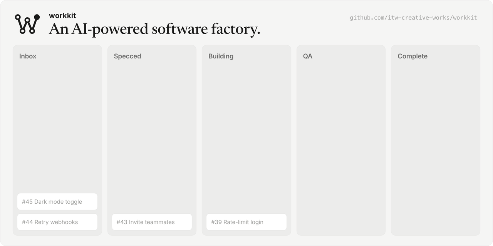

<p align="center"></p>

<h1 align="center"><picture><source media="(prefers-color-scheme: dark)" srcset="docs/assets/mark-dark.svg"></picture> workkit</h1>

<p align="center">One plugin turns your GitHub Issues into an automated SDLC pipeline. Each issue is specced, built, reviewed &amp; tested by an agent crew.</p>

workkit is a plugin for [Claude Code](https://code.claude.com/docs/en/overview), Anthropic's coding agent for the terminal.

## Install

```sh
git clone https://github.com/ITW-Creative-Works/workkit.git
cd workkit
./workflow/workkit.sh setup
```

Setup prints one line per step, so you can see what it did.
It asks before anything big: creating your home repo (a private GitHub repo for work that belongs to no single project), minting a Claude token, publishing the dashboard, and turning workkit on for the repo you are standing in.
It is safe to run again: every step checks first and only fixes what is missing.

When it finishes, the `workkit` command is in `~/.local/bin` (setup prints the PATH line to add if that folder is not on it).
`workkit doctor` shows what is set up, and `workkit help` lists every command.
Start a new Claude Code session so the plugin loads.

The plugin on its own, every setup step, and how to turn workkit on in another repo: [docs/setup.md](docs/setup.md).

## First use

Turn workkit on in a project of yours, then open Claude Code there:

```sh
cd <your-project> && workkit enable
claude
```

Type `/workkit:status` for a plain-language list of the open issues and what each one is waiting on.
No issues yet? Tell Claude what you want built, and it files the first one.

Then type `work on #12`, with a real issue number.
Claude checks the issue has an accepted spec, and interviews you to write one if not.
Then it builds the change with tests, has it reviewed, and leaves it in your working tree for you to try.

When you are happy, say `ship`.

## How it works

Every piece of work travels one road, and each stop is a label on its GitHub issue (`status:inbox`, `status:specced`, and so on).

1. **Capture.** An idea becomes an issue: from an issue form, a chat note, or `workkit note "the thought"` in any shell. It lands in the inbox.
2. **Triage.** `/workkit:triage` routes each new issue: shape it now, keep it for later, or close it.
3. **Spec.** You and Claude write down what done looks like. Accepting the spec is the go-ahead to build.
4. **Build.** Your chat acts as a manager. It hands the work to helper agents: one writes the code, one writes the tests, and a third checks both without seeing how they were made.
5. **Check.** The finished work waits, uncommitted, until you have tried it and said it is good.
6. **Ship.** Say `ship`. Claude writes the changelog entry, commits, releases, and closes the issue.

Hooks guard each step on their own. For example, no code commits until the full test suite has passed on exactly what is being committed.
The rules for every stop: [docs/project-state.md](docs/project-state.md).

## Seeing your board

The dashboard shows the board of every repo in one place, and it comes in three tiers. Use whichever suits you, and switch any time.

- **The central copy, out of the box.** Open <https://itw-creative-works.github.io/workkit/> and paste a GitHub token once. That address is the kit's own GitHub Pages site for now, so it may move. The token stays in that browser. The site holds no data: it reads GitHub live, and finds your home repo (`<login>/workkit`) from the token.
- **The local tower.** `workkit tower` runs it on your own machine, where it also shows the running agents, token spend and repo health.
- **Your own published copy.** `workkit publish` puts it on your home repo's GitHub Pages, for a custom domain or full control.

The token, and what each tier needs: [docs/setup.md](docs/setup.md#three-ways-to-see-your-board).

## What is inside

| Part | Count | What it does |
|---|---|---|
| [Hooks](docs/hooks.md) | 27 | Run by themselves: at session start, before edits and commits, and when a reply ends |
| [Agents](docs/agents.md) | 5 | The crew your chat delegates to, each briefed from a role template in [`briefs/`](briefs/) |
| Skills | 9 | Procedures Claude follows when your words match, or when you type `/workkit:<name>` |
| [Dashboard](tower/README.md) | 7 pages | `workkit tower` opens a local view of every board, the running agents, token spend, and repo health |
| [Daily brief](jobs/README.md) | 1 job | A 9am summary of every repo, posted as a GitHub Discussion on your home repo |

### Skills

`workkit:feature` · `workkit:interview` · `workkit:diagnose` · `workkit:review` · `workkit:triage` · `workkit:status` · `workkit:checkpoint` · `workkit:migrate` · `workkit:ship`.
Each is one `SKILL.md` of bullets, at most 120 non-blank lines with no line over 400 bytes; the test suite fails a skill that grows past that.

## Requirements

- git
- the GitHub CLI (`gh`), signed in with `gh auth login`
- jq
- Node.js with npm, a current LTS release
- the Claude Code CLI (`claude`)

It runs on macOS, on Linux, and on Windows under Git Bash. The 9am schedule on your own machine is macOS only; everywhere else the same brief runs in the cloud from your home repo.

## Docs

- [docs/setup.md](docs/setup.md): every install option, what setup does step by step, and the folder layout
- [docs/project-state.md](docs/project-state.md): the rules: labels, capture and triage, specs, the proof, shipping
- [docs/agents.md](docs/agents.md): the crew, how big a crew each job gets, and how work is handed to it
- [docs/hooks.md](docs/hooks.md): what each hook does, when it fires, and where it stands down
- [workflow/README.md](workflow/README.md): the engine behind the `workkit` command
- [AGENTS.md](AGENTS.md): the architecture, for agent sessions

## License

[Functional Source License, Version 1.1, MIT Future License](LICENSE.md) (FSL-1.1-MIT). Use it, change it, share it, and run it inside your own work freely; do not offer it as a competing product or service. Each release becomes MIT two years after it ships.
