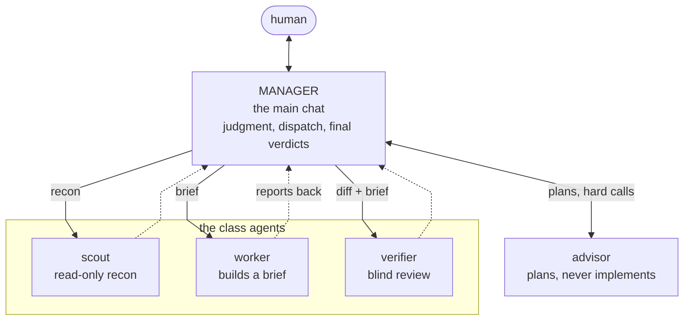

# Agents: the workkit crew

Agent definitions shipped by the workkit plugin. They surface in a session namespaced as `workkit:<name>`. **An agent exists here only if a flow dispatches it**. Unrouted agents are dead weight. Every definition names its dispatcher below.

## Roster

| Agent | File | Dispatched by |
|---|---|---|
| `workkit:reviewer` | `reviewer.md` | the `workkit:review` flow (compliance lens) |
| `workkit:scout` | `scout.md` | the manager profile (recon) + `workkit:review` lenses |
| `workkit:worker` | `worker.md` | the manager profile (implementation) |
| `workkit:verifier` | `verifier.md` | `workkit:review` scorer/light tier + the manager profile |
| `workkit:advisor` | `advisor.md` | the manager profile, in sessions below the frontier tier |

## Classes (the manager system)

`scout` / `worker` / `verifier` / `advisor` are the CAPABILITY CLASSES of the manager system. Their concrete model is supplied per spawn by the `manager/resolver` hook from `../hooks/manager/resources/ladder.json` (the tier SSOT) and the LIVE session model. A mid-session `/model` switch takes effect on the next spawn. The `model:` frontmatter in these four files is only the static fallback for when the hook is disabled; never treat it as the routing truth, and never pass a `model` param when dispatching them. Effort is the other way round: the ladder sets models only, and each class's effort lives in its own file's `effort:` frontmatter line, the one place Claude Code reads it (the Agent tool takes no effort per spawn). An agent file with no `effort:` line follows the session's.

The manager is whichever model the chat runs on, so the topology follows the session's model: a frontier session never spawns the advisor, and a workhorse session consults it for plans and hard calls.

Test scope is doctrine for every class, the manager included: a worker's mid-work proof is the test files it touched, red-green on the new cases; a verifier runs the narrowest command that checks the claim. None of them runs a package or root suite unless the brief asks or the finding is suite-scoped. The full suite runs once per tree, as `npm test` at the repo root before the commit: the shell records the tree it proved, and the gate checks the record (spec § The proof); `safety/suite-guard` bounces a repeat full run on a tree already proved green, from any class. The per-feature run is enforced too: `safety/proof-guard` runs the touched test files at the flip to `status:qa`. The rule is the spec's: `project-state.md` § The proof.

Drift is verifier doctrine: every blind verification also asks the three DRIFT questions past its brief, parity siblings on the other surfaces, duplicates of anything hand-typed the diff adds (found by grep), and the docs the change made stale. They live in `../agents/verifier.md` § Behavior, which quotes the Parity mandate `../skills/review/SKILL.md` § 2 owns, and they are asked per group, each group's verifier over its group's diff, while the batch's one review panel carries the check across groups through its Parity lens (§ Batches). The worker carries the other half of the same ruling: a hand-typed thing found wrong once is grepped across every package, fixed at the sites the brief covers, and every other site is NAMED in the report (`../agents/worker.md`, fix the class). The wider counterpart is per SHIP, not per batch: `workkit:ship` reviews the whole ship diff every time, light when the full-panel review marker already covers it and full otherwise (`../skills/ship/SKILL.md` step 3.2b).

Visibility is manager doctrine, injected every prompt by the `manager/profile` hook: keep a visible checklist with the todo tool for any multi-step task, kept current as steps start and finish; announce every crew spawn in chat as it is made (class, model per the ladder, one-line mandate) and report what it returned.

### Crew sizing

The manager stages the crew to the task rather than assembling it all at once: a small change is the manager alone (a line or a function, no spawn); every build past that is a feature-developer and test-developer pair on the shared tree (below), one pair per group in a batch (§ Batches), save a group with no test surface; the `verifier` runs twice, when the build claims done and over the review's fixes (`skills/feature/SKILL.md` § 5); the full review panel assembles only inside `workkit:review` and `workkit:ship`. `scout` is recon. Dispatch it at any point. Dispatch is one level deep throughout (§ Definition rules), so every stage is the manager's to open and close, and the manager keeps `.workkit/agents/session.md` current as it goes: the task queue and quick notes, with durable facts promoted to their issue the moment they exist. Design calls, contract changes, final verdicts, and anything security-adjacent stay the manager's, never the crew's. The self-edit line: the manager edits inline only when doing the edit costs fewer tokens than briefing a worker, in practice up to a line or a function; anything larger goes to a pair and gets the blind verify.

The pair is two `workkit:worker` briefs: a **feature-developer** who edits only the group's source paths and a **test-developer** who edits only its test paths. Each brief names its paths, neither role reads the other's files, and both build from the issue's `### Contract` (`project-state.md` § Specs), so no agent writes a test to fit its own code. A test-developer who cannot write a failing test from the Contract reports it: that is a Contract defect for the manager, never a test rewritten to fit. A test the feature-developer believes wrong is reported, never edited; the manager rules. The test-developer's own run of its test files on the shared tree is informational: it reports what it saw, red or green, since the feature-developer may be mid-edit, and the verifier's red proof is the proof. Two roles running one package's tests at the same moment within a pair is an accepted race.

Red first is proven by execution, not by sequence. The group's verifier runs `scripts/red-proof.sh <source paths> -- node --test <test files>`, which runs the tests in a copy of the tree holding the source paths as HEAD has them (red expected: the tests fail without the source); the verifier then runs the test files on the shared tree itself (green). The copy holds HEAD, the working diff and a link to the root `node_modules` only, so a test that needs another gitignored input (a nested `node_modules`, `dist/`, `.env`) fails there for that reason; the verifier reads the command's output before accepting a red, and reports an environmental red as a finding, never as the proof. The verifier is one per group, blind over the group's merged diff, both roles' paths; its questions are `../agents/verifier.md`'s.

A group with no test surface (docs, skills, agent files, issue forms) is ONE worker with no test-developer. Its verifier skips the red proof and says so, and the `Proof:` line records `red-proof: none (no test surface)` (`project-state.md` § The proof).

### Batches

A batch (`project-state.md` § Queue semantics, the Batches bullet) builds in parallel groups on the shared tree and rides one commit and one ship. The session is the only manager.

Before any spawn the manager groups the batch's issues by three forces in order, a later one never overriding an earlier: dependency edges (a blocker and its dependent never in different concurrent groups), then shared seams (issues touching one file, module or package go in one group, so two workers never write one file or run one package's prepare or tests at the same moment), then size balance. The grouping is said in chat and recorded on each issue's claim comment.

Each group gets ONE pair (§ Crew sizing), a feature-developer brief and a test-developer brief, and every group's pair is launched in one message. Each group gets ONE verifier, blind over that group's merged diff against both briefs: the briefs name the group's files, and the verifier reads `git diff HEAD -- <those paths>` plus `git status --short -- <those paths>` for new files, which no other group touches. A ≥80 finding the fix-or-file rule keeps goes back to that group's pair for one round, to the role whose paths it names. The manager does not edit the tree while group workers run: a manager edit lands inside a running worker's files.

Once every group's verifier has reported and its fix round has landed, ONE `workkit:review` full panel reads the whole batch diff, never one per issue; its marker is what the commit's gate reads. Then one light verification pass over the panel's fixes, one worker round, the review marker retouched so it covers the parked diff (`skills/feature/SKILL.md` § 5), and the park of every issue.

The ends are per issue: the spec pass and the claim at the front; the park and the check at the back (the owner's check, or the agent's own under `agent:ok`). The commit is one per batch, proved by the root `npm test`. `agent:ok` decides who checks and whether the agent ships, never how the build runs. The qa flip's `safety/proof-guard` run covers every test file the working diff touched, which for a batch is the union of its groups.

### Questions to the owner

A decision put to the owner is SELF-CONTAINED: the question carries its full background in plain words (what the item is, why it needs a decision now, and what each choice means in consequence) written for an owner who has read nothing else this session. The shape of the question itself (numbered, a plain paragraph first, options as nested bullets with the recommended one first and bold) is the `workkit:interview` skill's, § How questions are asked, and it binds every decision put to the owner. Unrelated decisions still batch into one pass: the questions arrive together, each standing alone.

## Agents from other repos

A session's agents come from three places: any plugin ships them in its own `agents/` directory (this repo's, namespaced `workkit:`, is one such set), a repo ships them in `.claude/agents/`, and a user in `~/.claude/agents/`. Precedence on a name collision is **project > user > plugin**.

The `manager/resolver` hook routes ONLY the four workkit classes above. Every other `subagent_type`, foreign or built-in, passes through untouched. So a foreign agent's `model:` frontmatter IS its contract: nothing here overrides it, and nothing here needs to know it exists. Ladder routing for foreign agents is deliberately unbuilt; it waits for a real consumer to name what it needs.

## Personal add-ons

A workkit agent is customized by STACKING onto it, never by replacing it: the flows always dispatch `workkit:<name>`, and a personal layer adds to that agent at spawn.

- **Where it lives**: `~/.workkit/agents/<name>.md` (the workkit GLOBAL layer; `WORKFLOW_HOME` moves it), one file per agent, named by the agent's bare name: `scout.md` stacks onto `workkit:scout`, `reviewer.md` onto `workkit:reviewer`.
- **How it arrives**: the `manager:addon` hook (SubagentStart) reads the file each time that agent spawns and adds its text to the agent's context, under a one-line header naming the file. One mechanism serves every workkit agent, present and future; there is no per-agent code.
- **What it can do**: add context. Preloads, house rules, the skill or doc to read first, anything the agent should know before its first prompt.
- **What it cannot do**: change the agent's `tools`, `model` or `effort`, or remove anything the shipped definition says. Those stay the agent file's (and the resolver's, for the model).
- **No file, or a blank one**: the agent runs exactly as shipped, which is the normal case. A file that exists but cannot be read is an error, shown as a hook error notice in that agent's transcript, never a silent skip.
- A change to the file lands on the next spawn; no restart needed.

## File-handoff convention (all dispatches)

A chat-inline brief bloats the dispatching context; a report file the dispatcher then has to open is a round trip nobody needs. So the two halves go opposite ways:

1. **Brief in a file.** The dispatcher writes the task brief to a file (session scratchpad dir) and passes the path plus a 1–3 sentence dispatch line. Briefs are **behavioral, not procedural**: state the goal, constraints, and done-criteria, not step-by-step file paths that go stale. A brief file exists only for a dispatch being made now: the spawn rides the same turn (or the owner explicitly asked for the file). The owner saying "brief me" is asking for a chat summary, never a file. A brief also NAMES the framework guide(s) the agent must read before its first edit, so that reading is routed by the dispatcher instead of guessed at.
   A brief starts from its role template in `../briefs/` (`<job>-<role>.md`, one per crew role): the dispatcher fills the slots with the task's facts and restates nothing fixed. Three layers, only the top one written per task: the agent file says who the agent is, the template what the job is, the brief which task. A fix round reuses the developer templates with the findings as the task. The `{{kit}}` slot takes the plugin root's real path (`dirname "$(cd -P ~/.claude/workkit && pwd)"`): the agent works in the task's repo, which may not be workkit, and neither the Read tool nor a shell `cd` resolves `..` through the `~/.claude/workkit` link.
2. **Report inline.** The agent's final message IS the report: a completion status, commits if any, and the findings the dispatcher needs to act, written for a reader who has not seen the work. A finding or a line that restates an issue reads in the cold-reader line (`docs/project-state.md` § Restating an issue). No report file, and no summary file beside it.
3. **A report FILE is the exception.** Only when the brief explicitly asks for one: a large artifact meant to be read selectively rather than in chat. Then the final message stays status, commits, and ONE line of result plus the path.

Each agent file inlines the slice of this it needs, so it stays portable. This README is the full statement, not an import target.

### Completion statuses

| Status | Meaning |
|---|---|
| `DONE` | Done-criteria met, verified this run |
| `DONE_WITH_CONCERNS` | Done-criteria met; report lists risks/follow-ups |
| `BLOCKED` | Cannot proceed: report says what's missing and what was tried |
| `NEEDS_CONTEXT` | Brief is ambiguous: report lists the specific questions |

After **3 failed attempts** at the same obstacle, stop and return `BLOCKED` with the attempts documented. Don't burn the run retrying.

## Definition rules

- **Subagents NEVER spawn subagents.** One level of dispatch only: the main session is the only dispatcher (reference: https://code.claude.com/docs/en/sub-agents).
- Frontmatter: `name`, `description`, `tools` (minimum set: the list is also what mechanically keeps an agent from spawning subagents), and for the class agents `model` (fallback only, § Classes) + `effort`.
- **No knowledge in agent files**: agents define behavior and preloads; knowledge lives in skills/docs. The reviewer's "derive the checklist from live docs" pattern is the model.
- **Every markdown file in `agents/` surfaces as an agent type**, which is why this document lives in `docs/` instead: a contract kept beside the definitions would become a definition.
- **No machine-specific paths.** These files ship to any repo on any machine: no absolute paths, no pointers into a personal `~/.claude` tree beyond what every Claude Code install has.
- Repo-doc entry point: AGENTS.md. A repo carries no `CLAUDE.md`; one still present is healed by the spec's § Repo docs.
