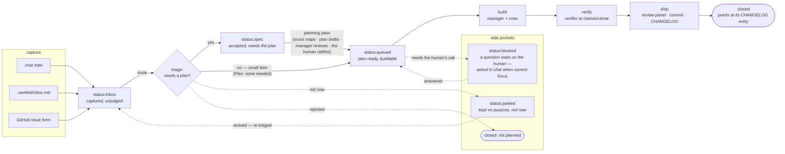
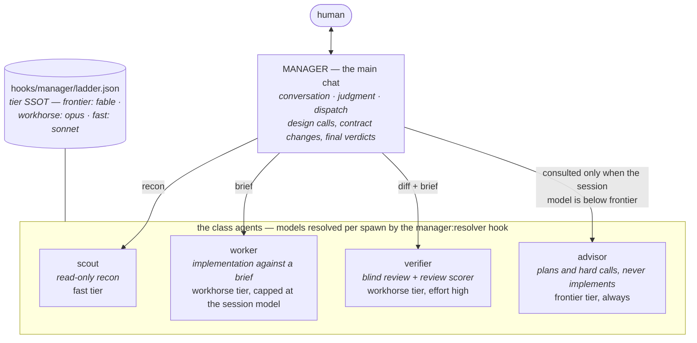

# The pipeline — intent to implemented

Every piece of work travels one road: captured as intent, accepted and spec'd, built by the crew, verified, shipped with its docs and CHANGELOG entry, closed. The stages are the `status:` labels themselves — the board IS the pipeline. This page is the visual map; the rules live in [project-state.md](project-state.md) (stages, labels, issue anatomy) and the crew mechanics in the [agents reference](agents.md) and the hook inventory in [AGENTS.md](../AGENTS.md).

## The road

- **`status:inbox`** — anything captured, from a chat aside to an issue-form submission. The `workkit:triage` skill drains it.
- **`status:spec`** — accepted work that is not yet buildable: the issue's `## Plan` lacks its implementation layer. The planning pass (a scout maps the code, a plan drafts against the issue, the manager reviews, the human ratifies) is what earns `status:queued`. A small item skips this stage — triage sends it straight to `status:queued` with the literal Plan `None needed — small item.`
- **`status:queued`** — plan ready. The ONLY stage builds start from, and the only pool `agent:ok` autonomy ever pulls from.
- **build → verify → ship** — not labels but the working stages of a queued issue: the crew builds, the verifier judges the diff blind, and the ship step runs the review panel, commits with `Fixes #N`, and writes the CHANGELOG entry. Closing the issue against that entry is the pipeline's exit.
- **`status:blocked` / `status:parked`** — side pockets, not stages: a question waiting on the human (delivered in chat when the work is current focus), and deliberate not-now.

## The crew that works it

- The **manager** is whichever model the chat runs on; the topology follows the model button — a frontier session never spawns the advisor, a workhorse session consults it for plans.
- **Crew sizing is policy, not mood**: a small change is the manager alone or one worker; a feature is one worker (a pair only under worktree isolation); the verifier runs once at claimed-done; the full review panel (the `workkit:reviewer` agent + scout lenses + verifier scorer) assembles only inside `workkit:review` and `workkit:ship`.
- **Models are supplied per spawn** by the `manager/resolver` hook from `ladder.json` and the live session model; per-repo and per-user `manager` blocks in `.workkit/settings.json` override tiers or turn the crew off (`enabled: false`).

## What enforces each hop

| Hop | Mechanism |
|---|---|
| capture → `status:inbox` | issue forms + the `docs:state-check` hook announcing the count |
| `status:inbox` → routed | the `workkit:triage` skill (never drained as a side effect) |
| `status:spec` → `status:queued` | the planning pass, ratified by the human — the `workkit:feature` skill refuses to build below `status:queued` |
| build quality | the `code:lint` hook per edit; suite green + fresh review marker enforced by the `safety:commit-gate` hook at commit |
| ship exit | `Fixes #N` closes the issue on push; the CHANGELOG entry format held by the `docs:changelog-guard` hook |
| label integrity | the daily `workflow:standards` heal syncs `labels.json` and names label-shape offenders |
